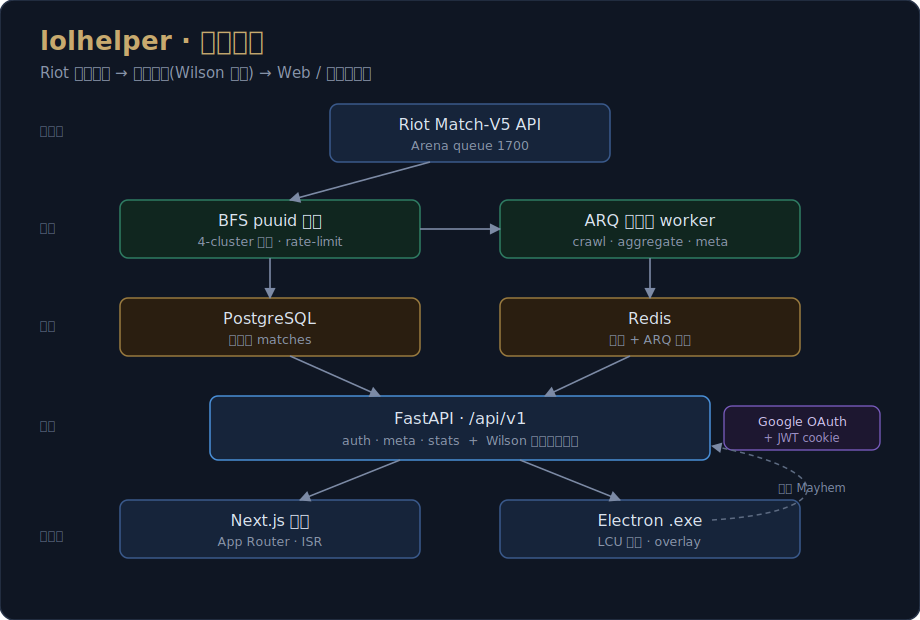
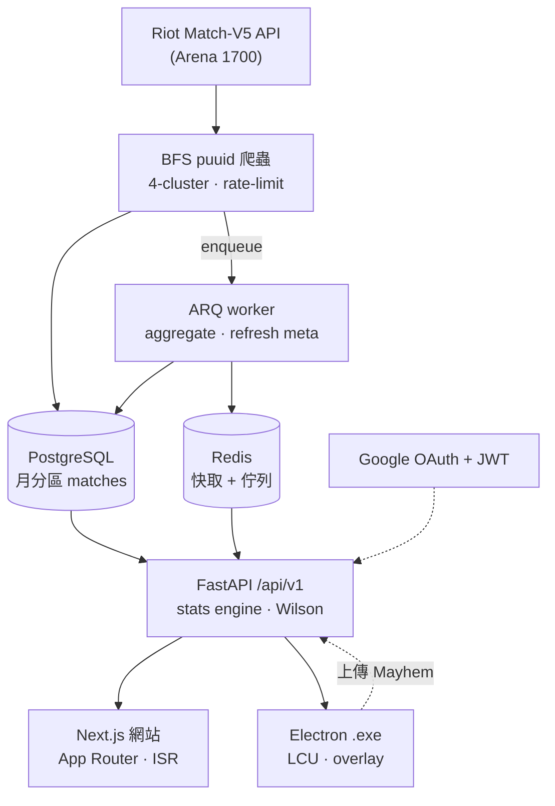

# LOL Helper

> OP.GG 風的《英雄聯盟》統計工具,專注 **競技場 Arena** 與 **海克斯大亂鬥 Mayhem** —— 全端 async 資料管線 + 統計引擎 + Web/桌面雙客戶端。


<p align="center">
  
</p>

---

## 這是什麼

從 Riot Match-V5 API 聚合競技場對戰資料,用 **Wilson 信心區間** 計算 augment / 裝備 / 核心組建 / 英雄搭配的可信勝率排行,以 OP.GG 風網站呈現;並以 Windows `.exe` 客戶端突破 Riot 對 Mayhem 模式的 API 封鎖。

## ✨ 技術亮點

- **非同步資料管線**:FastAPI + asyncio + asyncpg + ARQ worker,Riot Match-V5 走 BFS puuid 爬蟲,4 個 region cluster 並行 + 自動 rate-limit,personal key 下約 **5 萬場/天**。
- **統計嚴謹度**:勝率排序用 Wilson score interval 下界,避免「5 戰 5 勝=100%」的小樣本假象;分級 S/A/B/C/D 為 Tier-first 排序。
- **繞過 API 封鎖的設計**:Riot 永久封鎖 Mayhem 的 Match-V5,改以桌面 `.exe` 讀本機 LCU 群眾外包對戰資料 —— 在 ToS 紅線內取得別人拿不到的資料。
- **單一設定來源**:全部 secret/URL 走 pydantic-settings 讀 `.env`,正式環境啟動防呆拒絕預設金鑰。
- **零成本可部署**:Oracle Cloud Free ARM + Vercel hobby + Cloudflare DNS。
- **monorepo**:pnpm workspaces + turbo,backend(Python/uv)、frontend(Next.js)、client(Electron)、shared-types。

## 🎯 為什麼需要 .exe 客戶端

Riot **永久封鎖**了 ARAM Mayhem(queueId=2400)與 Brawl(queueId=2300)的 Match-V5 API,所有第三方網站(OP.GG / U.GG / metasrc)都拿不到這兩個模式的全球統計([Riot 員工於 Issue #1109 公開確認](https://github.com/RiotGames/developer-relations/issues/1109))。唯一可行來源是讓使用者本機 LCU 上傳對戰資料聚合 —— 這就是 `.exe` 客戶端的核心職責。Arena(queueId=1700)的 Match-V5 開放,後端走標準 BFS 爬蟲。

## 🏗️ 架構

頂部圖為系統總覽;下方為資料流(GitHub 原生渲染):



| 目錄 | 用途 | 技術 |
|------|------|------|
| `backend/` | API + 爬蟲 + 聚合 | Python 3.12 / FastAPI / asyncio / SQLAlchemy 2 async / asyncpg / ARQ |
| `frontend/` | 統計網站(SEO + 瀏覽) | Next.js 15 App Router / TypeScript / Tailwind |
| `client/` | Windows .exe(M2 開發中) | Electron / React / TypeScript |
| `packages/shared-types/` | TS 共用型別 | — |
| `infra/` | 部署設定 | docker-compose / Caddy |

## 🚀 快速開始(本地開發)

需求:Node ≥ 20.10 + pnpm ≥ 9、Python 3.12 + [uv](https://github.com/astral-sh/uv)、Docker Desktop、[Riot API key](https://developer.riotgames.com/)。

```bash
# 1. 安裝相依
pnpm install
cd backend && uv sync && cd ..

# 2. 設定環境變數（必填 RIOT_API_KEYS、JWT_SECRET）
cp .env.example .env
#   JWT_SECRET=$(openssl rand -hex 32)

# 3. 起本地 Postgres + Redis，跑 migration
pnpm infra:up
pnpm backend:migrate

# 4. 拉 metadata + seed 高分牌位 puuid
cd backend && uv run python -m scripts.refresh_metadata && uv run python -m scripts.seed_initial --all && cd ..

# 5. 三個 terminal 分別啟動
pnpm backend:dev       # API
pnpm backend:worker    # 爬蟲 worker（持續抓資料）
pnpm frontend:dev      # 前端
```

開 http://localhost:3000

## 🧪 測試

```bash
cd backend && uv run pytest        # 後端單元測試
cd backend && uv run ruff check .  # lint
pnpm --filter @lolhelper/frontend test   # 前端 Playwright e2e
```

## 📸 Demo

> _(截圖 / 錄影待補：英雄頁、augment 排行、tier 表)_

線上 demo:_(部署後補上 Vercel 連結)_

## ⚠️ 已知限制

- **Mayhem 全球統計**需 `.exe` 客戶端群眾外包資料量到一定規模才有統計意義(M2)。
- **技能順序/點法**需 Match-V5 timeline endpoint,工程較大,尚未實作。
- Personal API key 限速 100 req/2min;production key 才能大規模爬取。
- `.exe` 客戶端(M2)、遊戲內即時 overlay(M3)仍在開發。

## 📄 授權與法律聲明

MIT(LICENSE 待補)。

This product isn't endorsed by Riot Games and doesn't reflect the views or opinions of Riot Games or anyone officially involved in producing or managing League of Legends. League of Legends and Riot Games are trademarks or registered trademarks of Riot Games, Inc.

關於本工具如何處理 Riot 政策邊界,見 [`docs/tos-compliance.md`](docs/tos-compliance.md)。
